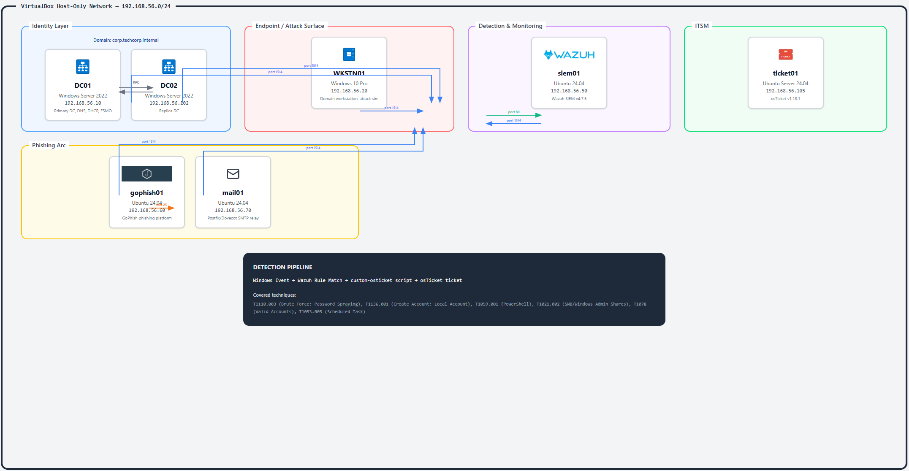

# Active Directory Detection Lab

A hands-on homelab simulating a small enterprise Active Directory environment for practicing real-world attack techniques and blue team detection engineering. Built from scratch using VirtualBox, Ansible automation, PowerShell scripting, and Wazuh SIEM — with a live Wazuh → osTicket integration that automatically creates incident tickets when detections fire.

> **WARNING:** Isolated lab environment only. All credentials are placeholders — never reuse lab passwords in any production or internet-facing system.

---

## Current State

**Phase 14 complete — all 7 VMs powered off at known-good snapshot `recovery-aligned-2026-04-11`.**

| VM | Role | IP | Snapshot | Agent |
|---|---|---|---|---|
| dc01 | Primary DC, DNS, DHCP | 192.168.56.10 | recovery-aligned-2026-04-11 | Active |
| dc02 | Replica DC | 192.168.56.102 | recovery-aligned-2026-04-11 | Active |
| wkstn01 | Domain workstation | 192.168.56.20 | recovery-aligned-2026-04-11 | Active |
| siem01 | Wazuh SIEM | 192.168.56.50 | recovery-aligned-2026-04-11 | Active/Local |
| ticket01 | osTicket ITSM | 192.168.56.105 | recovery-aligned-2026-04-11 | Active |
| gophish01 | GoPhish phishing | 192.168.56.60 | recovery-aligned-2026-04-11 | Active |
| mail01 | Postfix/Dovecot | 192.168.56.70 | recovery-aligned-2026-04-11 | Active |

**SOC pipeline:** Live — 7 MITRE ATT&CK techniques detected end-to-end, each automatically routed into osTicket as a structured incident ticket.

**Phishing arc:** GoPhish + Postfix online and Wazuh-enrolled. Detection rules not yet built (Phase 15).

**Known backlog:**
- AD replication broken since 2026-03-24 — Kerberos SPN mismatch (non-blocking, SIEM unaffected)
- ticket01 hostname still "osboxes" — cosmetic only
- Phase 15 phishing detection rules not yet built

---

- Build guides: [docs/](docs/)
- Operational docs: [docs/operations/](docs/operations/README.md)
- Automation: [ansible/](ansible/)
- Infrastructure-as-Code: [terraform/](terraform/)

Key references:
- [docs/operations/LAB-COMPLETE.md](docs/operations/LAB-COMPLETE.md) — full end-state reference
- [docs/operations/LAB-STATE.md](docs/operations/LAB-STATE.md) — session-by-session build log
- [docs/operations/LAB-CONTEXT.md](docs/operations/LAB-CONTEXT.md) — IPs, credentials, topology
- [docs/operations/HANDOFF.md](docs/operations/HANDOFF.md) — operational gotchas and session continuity

---

## Architecture



### Network

| VM | Hostname | IP | OS | RAM | vCPU | Role |
|---|---|---|---|---|---|---|
| dc01 | DC01 | 192.168.56.10 | Windows Server 2022 | 4 GB | 2 | Primary DC, DNS, DHCP, FSMO holder |
| dc02 | DC02 | 192.168.56.102 | Windows Server 2022 | 2 GB | 2 | Replica DC |
| wkstn01 | WKSTN01 | 192.168.56.20 | Windows 10 Pro 22H2 | 4 GB | 2 | Domain workstation, attack surface |
| siem01 | siem01 | 192.168.56.50 | Ubuntu 24.04 LTS | 4 GB | 2 | Wazuh 4.7.5 SIEM + manager |
| ticket01 | ticket01 | 192.168.56.105 | Ubuntu Server 24.04 | 2 GB | 2 | osTicket v1.18.1 ITSM |
| gophish01 | gophish01 | 192.168.56.60 | Ubuntu 24.04 | 2 GB | 1 | GoPhish phishing platform |
| mail01 | mail01 | 192.168.56.70 | Ubuntu 24.04 | 2 GB | 1 | Postfix/Dovecot SMTP relay |

- **Hypervisor:** VirtualBox 7.x — Host-Only Adapter (`192.168.56.0/24`), static IPs
- **Domain FQDN:** `corp.techcorp.internal` | **NetBIOS:** `TECHCORP` | **Forest/Domain Mode:** Windows Server 2016
- **DNS:** dc01 (`192.168.56.10`) — all VMs point here

### Domain Structure

All AD structure was provisioned via a sequenced set of PowerShell scripts — no manual clicking in AD Users & Computers.

- **1,800 domain users** scripted across 9 department OUs (200 per dept): IT, HR, Finance, Legal, Engineering, Marketing, Sales, Operations, Executive
- **Tiered admin model:** Tier0 (5 privileged Domain Admin accounts), Tier1 (5 service accounts with SPNs), Tier2 (bulk users and workstations)
- **Kerberoastable service accounts:** `svc_sql`, `svc_backup`, `svc_wazuh`, `svc_monitoring`, `svc_deploy` — each with a registered SPN, intentionally vulnerable to T1558.003
- **Dual DC:** dc01 promoted as forest root and FSMO holder; dc02 promoted as replica DC via separate script
- **Provisioning sequence:** `07-create-ou-structure.ps1` → `08-bulk-user-creation.ps1` → `09-service-accounts-spns.ps1` → `10-tier0-admins.ps1`

---

## Tech Stack

| Component | Version | Purpose |
|---|---|---|
| VirtualBox | 7.x | Hypervisor — hosts all 7 VMs |
| Windows Server 2022 | — | Domain Controllers (dc01, dc02) |
| Windows 10 Pro | 22H2 | Domain workstation — attack surface |
| Ubuntu Server | 24.04 LTS | Wazuh SIEM host, osTicket host, phishing hosts |
| Wazuh | 4.7.5 | SIEM, XDR, detection rules, MITRE dashboard |
| Sysmon | — | Enriched endpoint telemetry on WKSTN01 — process creation, network connections, PowerShell script block events |
| osTicket | v1.18.1 | ITSM — auto-receives incident tickets from Wazuh |
| GoPhish | — | Phishing campaign simulation |
| Postfix / Dovecot | — | Internal SMTP/IMAP relay for phishing arc |
| Ansible | 2.20.3 | Linux/Windows automation via SSH + WinRM from WSL2 |
| Terraform | 0.2.2-alpha | VM provisioning IaC (terra-farm/virtualbox provider) |
| PowerShell | 5.1 | 11-script AD provisioning sequence + 5 attack simulation scripts |
| WSL2 (Ubuntu) | — | Ansible control node on Windows host |

---

## Infrastructure Provisioning

The full lab stack — VMs, AD structure, and supporting services — is provisioned via a sequenced set of scripts. Nothing was configured manually through GUIs.

### VM Provisioning — Terraform + VBoxManage

`terraform/main.tf` defines VMs using the `terra-farm/virtualbox` provider (IaC reference). VMs are imported via `VBoxManage import` on Windows due to provider path limitations with OVA files on Windows hosts.

### Active Directory — PowerShell (11 scripts, run in order)

| Script | What it does |
|---|---|
| `01-dc01-network-config.ps1` | Static IP, DNS, adapter config on dc01 |
| `02-dc02-network-config.ps1` | Static IP, DNS, adapter config on dc02 |
| `03-wkstn01-network-config.ps1` | Static IP, domain DNS on wkstn01 |
| `04-winrm-setup.ps1` | Enable WinRM + TrustedHosts for remote execution |
| `05-promote-dc01.ps1` | Install AD DS, promote dc01 as forest root + FSMO holder |
| `06-promote-dc02.ps1` | Promote dc02 as replica DC, configure replication |
| `07-create-ou-structure.ps1` | Create Tier0/Tier1/Tier2 OUs + 9 department sub-OUs |
| `08-bulk-user-creation.ps1` | Create 1,800 users (200 per department) across Tier2 OUs |
| `09-service-accounts-spns.ps1` | Create 5 Tier1 service accounts, register SPNs (Kerberoastable) |
| `10-tier0-admins.ps1` | Create 5 Tier0 admin accounts, add to Domain Admins |
| `11-install-wazuh-agent.ps1` | Install Wazuh agent MSI on Windows VMs, set manager IP |

### Supporting Services — Ansible (4 playbooks)

| Playbook | What it does |
|---|---|
| `ticket01_lamp.yml` | Deploy Apache2, PHP 8.3, MySQL 8 on ticket01 |
| `ticket01_osticket.yml` | Deploy osTicket v1.18.1, configure departments/SLAs/topics |
| `siem01_osticket_integration.yml` | Deploy custom-osticket script + ossec.conf integration blocks |
| `dc01_register_ticket01_dns.ps1` | Register ticket01 A record on dc01 DNS |

Secrets managed via Ansible Vault (`group_vars/all/vault.yml`). WinRM transport for Windows, SSH key for Linux.

### Attack Simulations — PowerShell (5 scripts)

Each script generates real Windows event telemetry that triggers the corresponding Wazuh detection rule.

| Script | Technique | What it does |
|---|---|---|
| `attack-t1558-kerberoasting.ps1` | T1558.003 | Requests RC4-encrypted Kerberos tickets for all 5 SPNs |
| `attack-t1110-password-spray.ps1` | T1110.003 | Sprays failed logons across domain users to trigger lockout |
| `attack-t1078-privilege-escalation.ps1` | T1078 | Adds user to Domain Admins (Event 4728) |
| `attack-t1021-lateral-movement.ps1` | T1021.002 | Connects to admin share with explicit credentials (Event 4648) |
| `attack-t1136-rogue-account.ps1` | T1136.001 | Creates unauthorized domain user account (Event 4720) |

---

## Detection Pipeline

Every detection follows this path end-to-end:

```
Windows Event (dc01 / wkstn01)
    ↓  Wazuh agent → siem01 port 1514
    ↓  Wazuh rule match → triggers custom-osticket integration
    ↓  Python script POSTs to osTicket REST API (ticket01:80)
    ↓  Ticket created: correct dept / SLA / help topic / MITRE tag
    ↓  Analyst reviews in osTicket + Wazuh dashboard
```

**Integration script:** `/var/ossec/integrations/custom-osticket` on siem01 — Python 3, stdlib only, reads Wazuh alert JSON, maps rule ID to osTicket ticket metadata, POSTs to `http://192.168.56.105/api/tickets.json`.

---

## MITRE ATT&CK Coverage

### Live Detection → Ticket Pipeline

Every rule below fires on a real Windows event, reaches the Wazuh manager, and automatically creates an osTicket incident ticket via the custom Python integration.

| Technique | ID | Windows Event | Wazuh Rule | osTicket Dept | SLA |
|---|---|---|---|---|---|
| Brute Force — Failed Logon | T1110.003 | 4625 on DC01 | 60122 | IT Support | P2-High |
| Account Lockout | T1110.003 | 4740 on DC01 | 60115 | IT Support | P2-High |
| New User Created | T1136.001 | 4720 on DC01 | 60109 | Systems | P3-Normal |
| PowerShell Abuse | T1059.001 | 4104 on WKSTN01 (Sysmon + script block logging) | 91809 | Systems | P2-High |
| SMB Lateral Movement | T1021.002 | net use admin share | 92037 / 100209 | Systems | P2-High |
| Explicit Credential Use | T1078 | 4648 on WKSTN01 | 100210 | Systems | P2-High |
| Scheduled Task Persistence | T1053.005 | 4698 on WKSTN01 | 100211 | Systems | P2-High |

Rules 100209–100211 are custom — written where no built-in Wazuh rule existed. Deployed to `/var/ossec/etc/rules/local_rules.xml` on siem01.

### Simulation Rule Set (scripts/config/local_rules.xml)

A separate rule set designed to pair with the attack simulation scripts. These fire on the same Windows events and demonstrate detection logic without requiring the live osTicket integration.

| Rule | Technique | ID | Trigger |
|---|---|---|---|
| 100001 | Kerberoasting | T1558.003 | Event 4769 + RC4 encryption type (0x17) |
| 100002 | Password Spray | T1110.003 | 10+ Event 4625 from same source IP within 60s (frequency rule) |
| 100003 | Privilege Escalation | T1078 | Event 4728 — member added to Domain Admins |
| 100004 | Lateral Movement | T1021.002 | Event 4648 — explicit credential logon to remote host |
| 100005 | Rogue Account | T1136.001 | Event 4720 — new domain user created |

Rule 100002 uses Wazuh's frequency correlation engine — not a single-event match.

---

## Phishing Arc

GoPhish and Postfix are online and Wazuh-enrolled. Detection rules (Phase 15) are not yet built.

```
GoPhish campaign → mail01:25 (Postfix relay) → target inbox
                 → victim clicks link → gophish01:80 (credential harvest)
                 → GoPhish records open / click / submit events
```

**Next:** wire GoPhish and Postfix logs into the Wazuh → osTicket pipeline (T1566.001 / T1566.002).

---

## Detection Examples

### Account Lockout (T1110.003) — Rule 60115

Triggered when EventID 4740 (account locked out) arrives from DC01.

```json
{
  "rule": {
    "id": "60115",
    "level": 9,
    "description": "Windows: Account locked out (T1110.003)"
  },
  "agent": { "name": "DC01", "ip": "192.168.56.10" },
  "data": {
    "win": {
      "system": { "eventID": "4740" },
      "eventdata": {
        "targetUserName": "jsmith",
        "subjectUserName": "Administrator"
      }
    }
  }
}
```

---

### PowerShell Abuse (T1059.001) — Rule 91809

Triggered when EventID 4104 (script block logging) captures encoded or suspicious PowerShell on WKSTN01.

```json
{
  "rule": {
    "id": "91809",
    "level": 12,
    "description": "Windows: PowerShell script block logging — suspicious content (T1059.001)"
  },
  "agent": { "name": "WKSTN01", "ip": "192.168.56.20" },
  "data": {
    "win": {
      "system": { "eventID": "4104" },
      "eventdata": {
        "scriptBlockText": "[System.Convert]::FromBase64String(...)"
      }
    }
  }
}
```

---

## Investigation Walkthrough — Kerberoasting Alert

A full triage-to-close example using a simulated Kerberoasting alert.

### 1. Alert triage

Filter Wazuh Security Events:

```
data.win.system.eventID:4769 AND data.win.eventdata.ticketEncryptionType:0x17
```

Five alerts arrive within 3 seconds, all sourced from `192.168.56.20` (WKSTN01), each targeting a different SPN — consistent with automated enumeration.

| # | ServiceName | EncryptionType | ClientAddress | Time |
|---|---|---|---|---|
| 1 | svc_sql | 0x17 | 192.168.56.20 | 14:32:01 |
| 2 | svc_backup | 0x17 | 192.168.56.20 | 14:32:01 |
| 3 | svc_wazuh | 0x17 | 192.168.56.20 | 14:32:02 |
| 4 | svc_monitoring | 0x17 | 192.168.56.20 | 14:32:02 |
| 5 | svc_deploy | 0x17 | 192.168.56.20 | 14:32:03 |

### 2. Scope the source host

```
agent.name:WKSTN01 AND @timestamp:[now-15m TO now]
```

Look for 4624 Logon Type 2/10 (interactive logon before the spray) and 4688 Process Creation (PowerShell with encoded args).

### 3. Confirm on the DC side

```
agent.name:DC01 AND data.win.system.eventID:4769 AND data.win.eventdata.ticketEncryptionType:0x17
```

Cross-agent correlation confirms the ticket requests reached DC01's KDC — not just a local event.

### 4. Containment

| Action | Command |
|---|---|
| Rotate targeted service account passwords | `Set-ADAccountPassword` on dc01 |
| Enforce AES — disable RC4 | GPO → Account tab, uncheck "Use DES encryption types" |
| Isolate WKSTN01 if compromise confirmed | VirtualBox → disable host-only adapter |

---

## Quick Start

1. [Lab architecture overview](docs/01-architecture.md)
2. [Prerequisites & software requirements](docs/02-prerequisites.md)
3. [Network configuration (VirtualBox)](docs/03-network-configuration.md)
4. [WinRM & Ansible setup](docs/04-winrm-ansible-setup.md)
5. [Active Directory setup](docs/05-active-directory-setup.md)
6. [Wazuh SIEM deployment](docs/06-wazuh-siem-setup.md)
7. [Wazuh agent & log configuration](docs/07-wazuh-agent-configuration.md)
8. [Detection rules](docs/08-detection-rules.md)
9. [Troubleshooting](docs/09-troubleshooting.md)
10. [Extensions & next steps](docs/10-extensions.md)

**Reference:**
- [Useful Commands](docs/useful-commands.md)
- [Common Issues & Fixes](docs/common-issues.md)

---

## Repository Structure

```
ad-detection-lab/
├── README.md
├── CLAUDE.md                            # Operational boundary file
├── .gitignore
├── docs/
│   ├── 01-architecture.md through 10-extensions.md
│   ├── common-issues.md
│   ├── useful-commands.md
│   └── operations/                      # Live lab state and runbooks
│       ├── LAB-COMPLETE.md              # Full end-state reference
│       ├── LAB-STATE.md                 # Session-by-session build log
│       ├── LAB-CONTEXT.md               # IPs, credentials, topology
│       ├── LAB-PHASE-PLAN.md            # Phase plan and status
│       ├── LAB-PHASE-RUNBOOK.md         # Step-by-step phase runbooks
│       ├── HANDOFF.md                   # Operational gotchas
│       ├── AUDIT.md                     # Post-completion audit
│       ├── RECOVERY-2026-04-11.md       # Recovery runbook
│       ├── VALIDATION-RUN-2026-04-11.md # Validation run details
│       └── architecture/
│           └── lab-architecture-v2.png  # Architecture diagram
├── ansible/
│   ├── inventory/
│   │   └── hosts.ini                    # All 7 lab hosts
│   ├── group_vars/all/vault.yml         # Encrypted secrets
│   └── playbooks/
│       ├── ticket01_lamp.yml            # Apache + PHP + MySQL
│       ├── ticket01_osticket.yml        # osTicket deployment
│       ├── siem01_osticket_integration.yml  # Wazuh→osTicket deploy
│       └── files/
│           └── custom-osticket          # Python integration script
├── terraform/
│   └── main.tf                          # VM definition reference
└── scripts/
    └── python/                          # Helper utilities
```

---

## Reproducibility

- Inventory examples are sanitized — add credentials locally before use
- Real ISO paths, credentials, and host-specific values stay local and untracked
- Ansible vault file: `ansible/group_vars/all/vault.yml` (encrypted)

---

## License

MIT — see [LICENSE](LICENSE)
