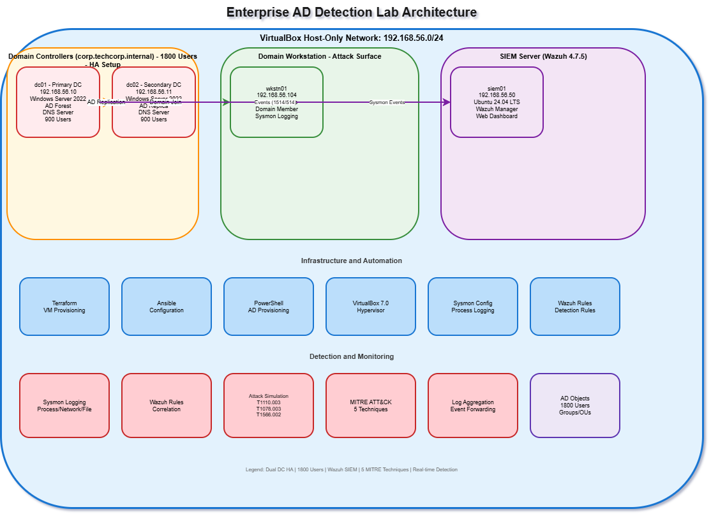

# Network Topology

## Lab Architecture Diagram



> Source: [lab-architecture-diagram.drawio](lab-architecture-diagram.drawio) — open in [draw.io](https://app.diagrams.net/) to edit.

## Lab Network Diagram

```
                    ┌─────────────────────────────────────────────┐
                    │         VirtualBox Host Machine              │
                    │                                              │
                    │  ┌────────────┐      ┌────────────────────┐ │
                    │  │   dc01     │      │       dc02         │ │
                    │  │ 192.168.   │◄────►│   192.168.56.102   │ │
                    │  │  56.10     │      │  Replica DC        │ │
                    │  │ Primary DC │      └────────────────────┘ │
                    │  │ DNS Server │                              │
                    │  └─────┬──────┘                             │
                    │        │                                     │
                    │  ══════╪══════════════════════════════════   │
                    │        │    192.168.56.0/24 (Host-Only)      │
                    │  ══════╪══════════════════════════════════   │
                    │        │                                     │
                    │  ┌─────┴──────┐      ┌────────────────────┐ │
                    │  │  wkstn01   │      │      siem01        │ │
                    │  │ 192.168.   │      │  192.168.56.103    │ │
                    │  │  56.20     │      │  Wazuh 4.7.5       │ │
                    │  │ Win10 WS   │      │  Ubuntu 24.04      │ │
                    │  └────────────┘      └────────────────────┘ │
                    └─────────────────────────────────────────────┘
```

## VM Inventory

| Hostname | IP Address | OS | RAM | vCPU | Role |
|---|---|---|---|---|---|
| dc01 | 192.168.56.10 | Windows Server 2016 | 4 GB | 2 | Primary DC, DNS, FSMO |
| dc02 | 192.168.56.102 | Windows Server 2016 | 2 GB | 2 | Replica DC |
| wkstn01 | 192.168.56.20 | Windows 10 Pro 22H2 | 4 GB | 2 | Domain-joined workstation |
| siem01 | 192.168.56.103 | Ubuntu 24.04 LTS | 4 GB | 2 | Wazuh SIEM server |

## Domain Information

| Setting | Value |
|---|---|
| Domain FQDN | `corp.techcorp.internal` |
| NetBIOS Name | `TECHCORP` |
| Forest/Domain Mode | Windows Server 2016 |
| DNS Server | 192.168.56.10 (dc01) |
| Subnet | 192.168.56.0/24 |
| Default Gateway | 192.168.56.1 |

## VirtualBox Network Adapter Configuration

- **Adapter Type:** Host-Only Adapter
- **Adapter Name:** `VirtualBox Host-Only Ethernet Adapter` (vboxnet0 on Linux/Mac)
- **DHCP Server:** Disabled — all VMs use static IPs
- **IPv6:** Disabled on all Windows VMs

> **Note:** The host-only network is fully isolated from the internet. No NAT or bridged adapter is used for lab traffic. VMs can only communicate with each other and the host machine.

## Port Reference

| Port | Protocol | Service | VM |
|---|---|---|---|
| 53 | TCP/UDP | DNS | dc01 |
| 88 | TCP/UDP | Kerberos | dc01, dc02 |
| 135 | TCP | RPC | dc01, dc02 |
| 389 | TCP/UDP | LDAP | dc01, dc02 |
| 445 | TCP | SMB | dc01, dc02, wkstn01 |
| 464 | TCP/UDP | Kpasswd | dc01, dc02 |
| 636 | TCP | LDAPS | dc01, dc02 |
| 3268-3269 | TCP | Global Catalog | dc01 |
| 5985 | TCP | WinRM (HTTP) | dc01, dc02, wkstn01 |
| 1514 | UDP | Wazuh agent | siem01 |
| 1515 | TCP | Wazuh enrollment | siem01 |
| 55000 | TCP | Wazuh API | siem01 |
| 443 | TCP | Wazuh web UI | siem01 |
